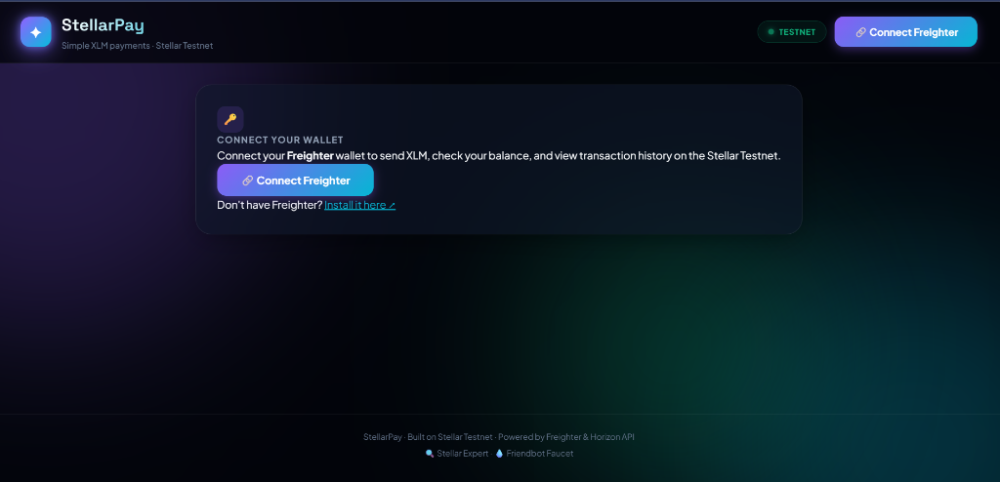
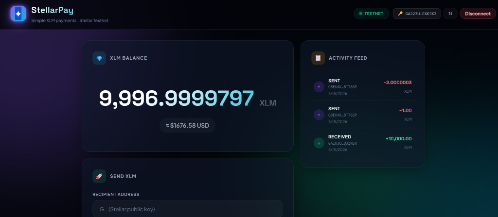
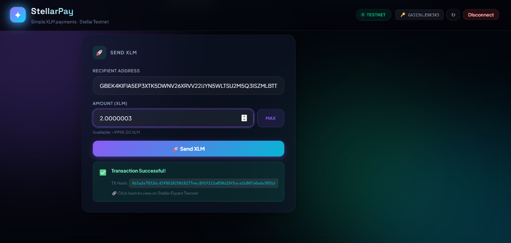
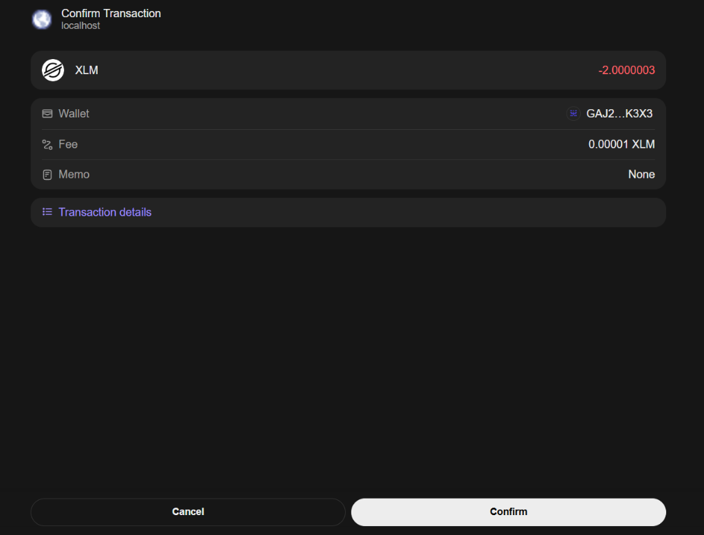
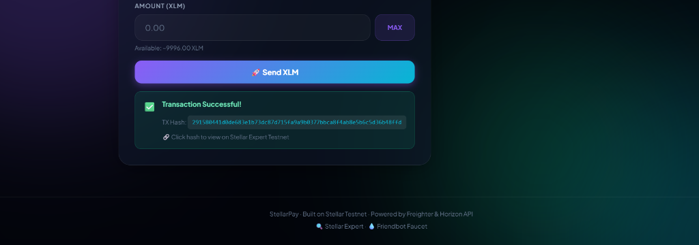

# StellarPay – XLM Payment DApp (Level 1)

A beginner-friendly decentralized payment application on the **Stellar Testnet**, built with React + TypeScript + Vite and the Freighter wallet.

---

## 📸 Screenshots

<p align="center">
  
  
</p>
<p align="center">
  
  
</p>
<p align="center">
  
</p>

---

## ✨ Features

| Feature | Details |
|---------|---------|
| 🔑 **Wallet Connect/Disconnect** | Freighter browser extension |
| 💎 **XLM Balance** | Live from Stellar Horizon Testnet + USD estimate |
| 🚀 **Send XLM** | Build, sign & submit payments with optional memo |
| ✅ **TX Feedback** | Clickable transaction hash or error details |
| 📋 **Activity Feed** | Last 8 transactions — click to view on Stellar Expert |
| ⚡ **Caching** | In-memory TTL cache to minimize API calls |

---

## 🛠 Tech Stack

| Layer | Technology |
|-------|-----------|
| Framework | React 18 + TypeScript |
| Build | Vite |
| Wallet | Freighter API |
| Blockchain | Stellar SDK + Horizon Testnet |
| Testing | Vitest + Testing Library |

---

## 📋 Level 1 Requirements

- [x] Freighter wallet setup on Testnet
- [x] Wallet connect & disconnect
- [x] Fetch & display XLM balance
- [x] Send XLM transaction
- [x] Transaction feedback (hash on success, error on failure)
- [x] Error handling throughout

---

## 🏃 Getting Started

### Prerequisites
- [Freighter browser extension](https://www.freighter.app/) installed
- Freighter set to **Testnet** (Settings → Network → Testnet)
- Node.js 18+

### Install & Run
```bash
npm install
npm run dev
```

Then open [http://localhost:5173](http://localhost:5173)

### Fund Your Wallet
Visit [Friendbot](https://friendbot.stellar.org/?addr=YOUR_PUBLIC_KEY) to get free testnet XLM.

---

## 🧪 Tests

```bash
npm test
```

Test suites:
- `cache.test.ts` – In-memory cache utility
- `stellar.test.ts` – Key validation, address formatting, XLM formatting
- `ProgressBar.test.tsx` – Component rendering and clamping

📸 *Screenshot of test output goes here*

---

## 🏗 Build

```bash
npm run build
```

Output is placed in `dist/`.

---

## 📁 Project Structure

```
src/
├── components/       # UI components (Header, BalanceCard, SendForm, ActivityFeed…)
├── hooks/            # useWallet
├── types/            # TypeScript interfaces
├── utils/            # cache.ts, stellar.ts, stellarTx.ts
└── tests/            # Vitest test suites
```

---

## 🌐 Deployment

```bash
npm run build   # Deploy dist/ to Vercel, Netlify, or GitHub Pages
```

## 🎥 Demo

🔗 Live Demo link goes here  
📹 Demo video link goes here

---

## 🔍 Resources

- [Stellar Expert Testnet](https://stellar.expert/explorer/testnet)
- [Stellar Laboratory](https://laboratory.stellar.org/)
- [Freighter Docs](https://docs.freighter.app/)

## 📄 License

MIT
